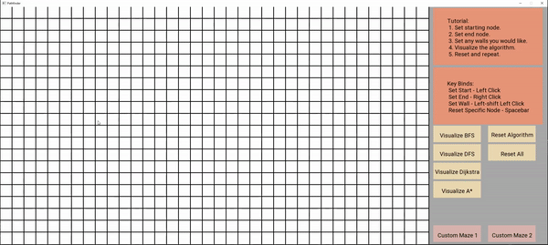

# Pathfinder

--- 
### What it looks like

### Features

- The starting and end positions can be assigned by left-clicking or right-clicking any node, respectively.
- Walls can be placed on any node (other than the starting and ending) by left-shift left-clicking on any node in the grid. 
- Pressing the spacebar on a starting node, ending node, or a wall, will clear it. 
- Once the starting and ending positions are set:
  - Selecting the "Visualize BFS" button will perform a Breadth First Search algorithm and find a path between the starting and end nodes.
  - Selecting the "Visualize DFS" button will perform a Depth First Search algorithm and find a path between the starting and end nodes.
  - Selecting the "Visualize Dijkstra" button will perform Dijkstra's algorithm and find a path between the starting and end nodes.
  - Selecting the "Visualize A*" button will perform the A-Star algorithm and find a path between the starting and end nodes.
- The "Reset Algorithm" button will reset any algorithm present and maintain the selected starting and end positions.
- The "Reset All" button will clear the entire grid.
- The "Custom Maze 1" button will deploy a preset maze (which can be customized by adjusting the values in the "Pathfinder/grids/grid1" file).
- The "Custom Maze 2" button will deploy a preset maze (which can be customized by adjusting the values in the "Pathfinder/grids/grid2" file).
- The grid will reflect any changes made to these files when the program is freshly run.

### Other features

- GUI that contains a tutorial and key binds section.

### Build instructions (MUST HAVE SFML INSTALLED AND WORKING)

- Clone and run on a C++ compiler (Version 14.31 was used for this project)
